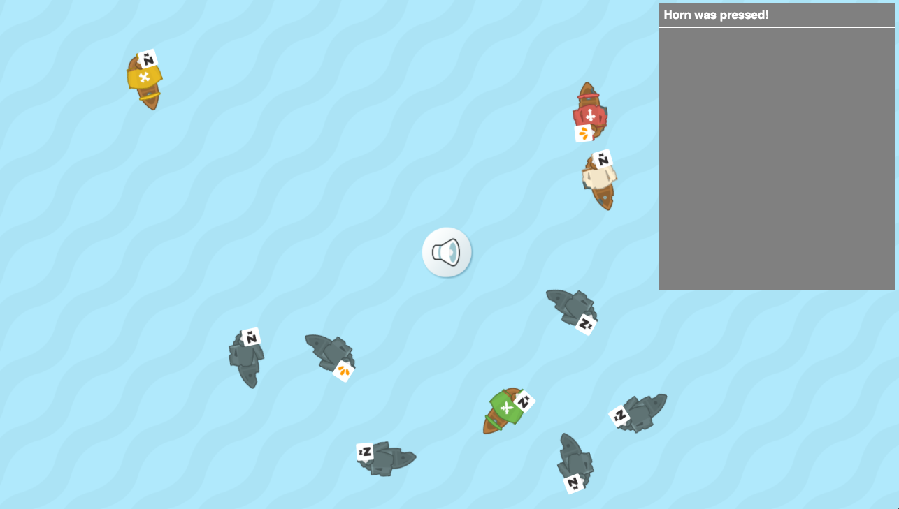

# PRG08-Notify-the-Captain-completed

Toevoegen van het Observer Pattern om de kapitein wakker te maken en een bericht te plaatsen op het mesaggeboard.

## Game play

- Wanneer op de horn wordt geklikt, komt er een bericht van activatie op het messageboard te staan. 
- Wanneer op een piratenboot geklikt wordt, zal deze actief worden en 'luistert' dan ook naar de horn. 
- Wanneer een piratenboot actief is en de horn gaat af, dan wordt de kapitein op dat schip wakker. 

## Opdracht
- Teken het klassendiagram en pas het *Observer Pattern* toe.
- Maak de code af volgens boven beschreven regels. 

